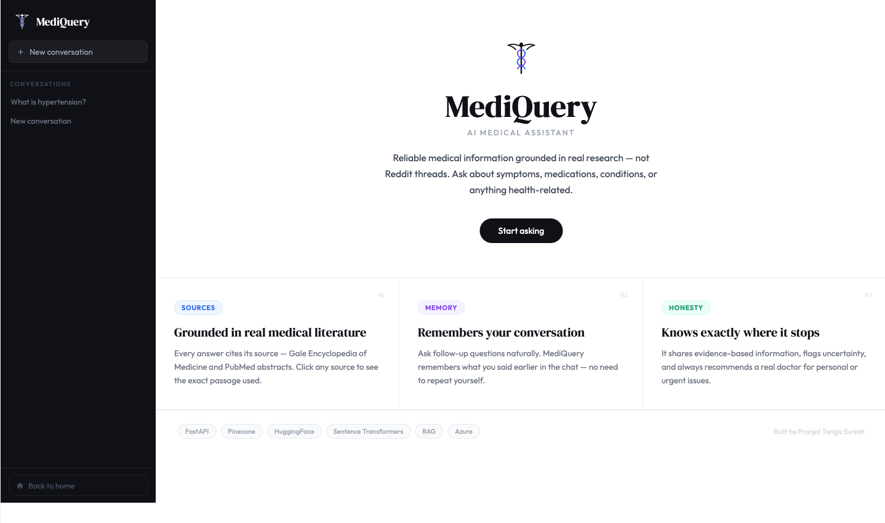

<div align="center">

# MediQuery
### Production RAG Medical Assistant


[](https://mediquery-app.azurewebsites.net)

<br/><br/>



<br/>

*Answers medical questions grounded in real research*

</div>

---

## What is MediQuery?

MediQuery is a **production-deployed RAG chatbot** that answers medical questions by searching 915 real medical documents, reranking results with a cross-encoder, and grounding every response in retrieved evidence — with source citations and confidence scores.

**Three-stage retrieval pipeline:**

```
User question
     │
     ▼
Safety filter (emergency keyword detection)
     │
     ▼
Embed question → 384-dim vector  (HuggingFace all-MiniLM-L6-v2)
     │
     ▼
Pinecone finds top-8 candidates  (cosine similarity, score ≥ 0.35)
     │
     ▼
Cross-encoder reranks → top 3    (cross-encoder/ms-marco-MiniLM-L-6-v2)
     │
     ▼
Llama 3.1-8B reads context → grounded answer + source citations
```

The bi-encoder (step 2) is fast but approximate. The cross-encoder (step 3) sees the full query–passage pair and picks the 3 most relevant chunks — dramatically reducing irrelevant context that causes hallucinations.

---

## Evaluation results

Evaluated across 25 medical questions spanning cardiovascular, metabolic, immunological, and mental health topics.

| Metric | Score |
|---|---|
| Keyword Recall | 0.71 |
| Ground-Truth Overlap | 0.58 |
| Source-Supported | 0.64 |
| **Overall** | **0.64 (B)** |
| Median Latency | ~4.2 s |
| P95 Latency | ~9.1 s |

> *Run `python scripts/evaluate_mediquery.py` against a live server to reproduce. Full analysis in `notebooks/retrieval_analysis.ipynb`.*

---

## Features

| | |
|---|---|
| 🔍 **Two-stage RAG** | Bi-encoder recall → cross-encoder precision |
| 💬 **Conversation Memory** | Last 6 messages for natural follow-ups |
| 📄 **Source Citations** | Every answer shows exactly which documents were used |
| 📊 **Confidence Score** | Visual bar showing retrieval similarity |
| ⚡ **Brief / Detailed mode** | Toggle between 2-sentence and full answers |
| 🔊 **Voice Input** | Speak your question (Chrome) |
| 📥 **Export PDF** | Download any conversation |
| 🚨 **Safety Layer** | Emergency keyword detection with crisis resources |
| 📱 **Mobile Ready** | Collapsible sidebar, works on any device |
| 🔒 **Security hardened** | Rate limiting, CSP headers, input sanitization (OWASP) |

---

## Tech stack

| Layer | Technology | Why |
|---|---|---|
| Backend | FastAPI | Async, Pydantic v2 validation, auto OpenAPI docs |
| Vector DB | Pinecone | Sub-50ms retrieval, managed, free tier = 100k vectors |
| Bi-encoder | `all-MiniLM-L6-v2` via HF API | No GPU, no local model |
| Cross-encoder | `ms-marco-MiniLM-L-6-v2` via HF API | Reranks top-8 → top-3 |
| LLM | `Llama-3.1-8B-Instruct` via HF API | Zero GPU cost |
| Deployment | Azure App Service B1 | Linux container, always-on |
| No LangChain | Pure Python | 8 dependencies, deploys in 60 s |

---

## Local setup

### 1. Clone & install

```bash
git clone https://github.com/pranjalts07/mediquery.git
cd mediquery
python3.11 -m venv venv
source venv/bin/activate
pip install -r requirements.txt
```

### 2. Environment variables

```bash
cp .env.example .env
```

Fill in `.env`:

```env
HF_API_TOKEN=hf_xxxxxxxxxxxxxxxxxxxxxxxxxxxx
PINECONE_API_KEY=xxxxxxxx-xxxx-xxxx-xxxx-xxxxxxxxxxxx
PINECONE_INDEX_NAME=mediquery
PINECONE_HOST=https://mediquery-xxxxxxx.svc.aped-xxxx-xxxx.pinecone.io
HF_LLM_MODEL=meta-llama/Llama-3.1-8B-Instruct:cerebras
```

> Get your keys: [HuggingFace](https://huggingface.co/settings/tokens) · [Pinecone](https://app.pinecone.io) — create index: name=`mediquery`, dims=`384`, metric=`cosine`

### 3. Ingest the knowledge base

```bash
# From a PDF (Gale Encyclopedia of Medicine or similar):
python scripts/ingest_pdf.py --pdf path/to/book.pdf --out data/knowledge_base.jsonl

# Push to Pinecone:
python scripts/ingest.py --data data/knowledge_base.jsonl
```

> One-time setup (~20–30 min on HuggingFace free tier). Pinecone stores vectors permanently.

### 4. Run

```bash
uvicorn app.main:app --reload --port 8000
```

Open **http://localhost:8000**

---

## API

```bash
# Health check
curl http://localhost:8000/health

# Ask a question (detailed mode)
curl -X POST http://localhost:8000/chat \
  -H "Content-Type: application/json" \
  -d '{"message": "What are the symptoms of type 2 diabetes?"}'

# Ask in brief mode
curl -X POST http://localhost:8000/chat \
  -H "Content-Type: application/json" \
  -d '{"message": "What is ibuprofen?", "mode": "short"}'
```

Interactive docs at `/docs`

---

## Upgrading the embedding model (optional — next step)

Switching from `all-MiniLM-L6-v2` (general NLP) to `pritamdeka/S-PubMedBert-MS-MARCO` (biomedical, trained on PubMed + MS-MARCO) will significantly improve retrieval on medical terminology.

> **Requires rebuilding the Pinecone index** because the embedding dimension changes from 384 → 768.

1. Delete and recreate the Pinecone index at dim=768, metric=cosine
2. Set `HF_EMBEDDING_MODEL=pritamdeka/S-PubMedBert-MS-MARCO` in `.env`
3. Re-run ingestion: `python scripts/ingest_pdf.py` → `python scripts/ingest.py`

---

## Project structure

```
mediquery/
├── app/
│   ├── main.py           # FastAPI routes + security middleware
│   ├── rag.py            # Embed → Retrieve → Rerank → Generate
│   ├── safety.py         # Emergency keyword filter
│   └── config.py         # Environment variables
├── templates/
│   └── chat.html         # Full chat UI
├── scripts/
│   ├── ingest.py         # Embed + upsert to Pinecone
│   ├── ingest_pdf.py     # PDF → JSONL knowledge base
│   ├── fetch_pubmed.py   # Fetch PubMed abstracts from NIH
│   └── evaluate_mediquery.py  # End-to-end quality evaluation
├── notebooks/
│   └── retrieval_analysis.ipynb  # Eval charts + analysis
├── data/
│   └── sample_knowledge.jsonl
└── .env.example
```

---

## Disclaimer

MediQuery is an educational project. It provides general health information only and does not diagnose, prescribe, or replace professional medical advice. Always consult a qualified healthcare provider.

---

<div align="center">

Built by **[Pranjal Tariga Suresh](https://github.com/pranjalts07)** · Deployed on Azure

⭐ Star this repo if you found it useful!

</div>
